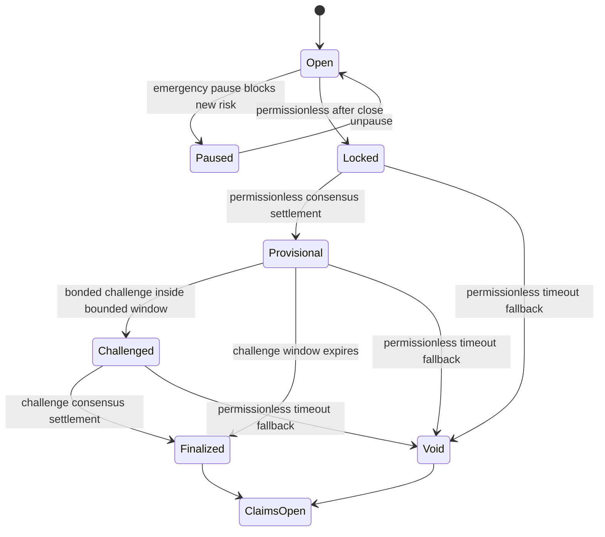

# OmniMarket V3 Protocol Design

## Status

**Design record only. Not deployed. V3 is implemented separately in
`contracts/omnimarket_v3.py`, never in `contracts/omnimarket.py`.**

V2 is a two-outcome, pari-mutuel, native-GEN testnet primitive. Its pool balances
are the source of both displayed prices and winning payouts. That accounting is
internally coherent for V2, but it cannot safely grow into transferable liquidity
shares, pre-settlement exits, and multi-outcome markets by appending a few methods.
Those features share the same collateral obligations. V3 is therefore a new
contract address and a separately audited release, not an `Upgrade code` action.

This boundary follows GenLayer's storage-compatible upgrade model: changing stored
field shapes or economic meaning requires a new deployment rather than an
incompatible upgrade. See the [official upgradability documentation](https://docs.genlayer.com/developers/intelligent-contracts/features/upgradability).

## Scope

V3 closes the unresolved product gates only when all of the following are built,
tested, independently reviewed, and deployed together:

| Gate | V3 capability | Non-negotiable property |
|---:|---|---|
| 37 | Cumulative volume | Track gross entered collateral independently from current reserves and fees. |
| 38 | Exit positions | A quote and exit must never create an unpaid winning claim. |
| 39 | LP lifecycle | LP shares represent a defined pro-rata claim, with deposits and withdrawals bounded by solvency rules. |
| 40 | Multi-outcome markets | Each market supports a bounded number of outcomes with a price vector that sums to 10,000 bps. |
| 41 | Challenge workflow | A challenge is time-bounded, bonded, observable, and cannot give an operator authority to choose a winner. |
| 42 | Immutable market content | The on-chain market record immutably stores the question, outcomes, rules, sources, close time, and market version. |
| 43 | Circuit breaker | Emergency controls stop new risk only; they never block claims, refunds, locking, or permissionless settlement. |

## Economic Architecture

V3 must use a fully collateralized conditional-claim market-maker design. A
simple extension of V2's pari-mutuel pools is explicitly rejected: allowing an LP
to withdraw from those pools before settlement would change the payout backing for
existing traders.

V3 uses a bounded fixed-product market maker over fully collateralized
conditional claims. Each accepted unit of native GEN collateral mints one claim
unit for every configured outcome. The contract keeps the unused claims in the
market maker reserves and transfers only the purchased outcome claims to the
trader. On a sell, the contract takes outcome claims back, burns the maximum
complete claim set permitted by the invariant, and releases only that burned
collateral less the published fee. No claim is created without matching
collateral and no exit releases collateral without burning matching claims.

At settlement, user-held winning claims and the LP-held winning reserve partition
the same `claim_units_per_outcome` supply. Trader claims reduce the market's
remaining backing; LP settlement redeems the separately tracked reserve that is
left after market making. Together, those two claim paths must equal the complete
winning-claim supply exactly once.

V3 intentionally supports **two or three outcomes**, rather than an unbounded
set. This bounds arithmetic and review surface while satisfying multi-outcome
markets. Its exact integer formula, including ceiling division on buys and a
maximal invariant-preserving binary search on sells, is executable in
[`v3/market-math.mjs`](v3/market-math.mjs). The contract and client must keep
these vectors byte-for-byte equivalent.

Before any V3 code is accepted, this model must have:

1. A written collateral-conservation proof for every state transition.
2. Exact integer rounding rules for buy, sell, LP deposit, LP withdrawal, fees,
   settlement, void, and dispute bonds.
3. A solvency invariant: the contract balance must cover all currently claimable
   outcome and LP obligations, plus separately accrued protocol fees.
4. A fuzz/property-test suite covering extreme pool sizes, all outcome counts,
   repeated deposits and exits, dust, and rounding boundaries.
5. An independent economic and security review before any real-value deployment.

Native GEN remains the collateral asset. As GenLayer documents, payable methods
receive the native value through `gl.message.value`; every V3 funding method must
check that value against its calldata amount. See [value transfers](https://docs.genlayer.com/developers/intelligent-contracts/features/value-transfers).

## V3 State Model

The new contract must use a versioned market record with a fixed, bounded maximum
outcome count. It must not mutate the V2 `Market` or `Position` storage schema.

Required persisted concepts:

- `market_version`, `outcome_count`, outcome labels, evidence
  sources, close time, lifecycle, and settlement receipt.
- Collateral reserves, per-outcome claim reserves, cumulative entered volume,
  protocol fees, and deterministic integer price observations.
- LP total shares, per-account LP shares, deposit/withdraw accounting, and locked
  withdrawal rules.
- Per-account outcome-share balances, quote nonce or bounded quote inputs, and
  per-market transaction/position indexes.
- A bounded challenge record with challenger, bond, status, deadline, and the
  final consensus receipt.
- Pause state plus the actor and timestamp for each pause transition.

Dynamic collections must use GenLayer-supported persistent storage structures and
custom persisted data must use the documented storage annotation pattern. See
[GenLayer storage](https://docs.genlayer.com/developers/intelligent-contracts/features/storage).

## Immutable Market Content

Every V3 market creation payload stores the complete market definition directly
in the immutable market record. The canonical UTF-8 JSON below is an off-chain
display and indexing reference, not a contract-verified cryptographic commitment:

```text
{
  "market_version": 3,
  "title": "...",
  "outcomes": ["..."],
  "rules": "...",
  "source_uris": ["..."],
  "close_time": "unix seconds"
}
```

The client may compute and display a SHA-256 reference identifier before
presenting the wallet signature and after reading the market. It must not label
that reference as contract-verified unless GenLayer publishes a supported,
deterministic in-contract hash primitive and the contract recomputes it itself.
The canonical JSON encoding, field ordering, whitespace policy, Unicode
normalization, and digest algorithm remain frozen in V3 test vectors so off-chain
indexers can reproduce the same identifier.

## Market Lifecycle



The pause state can block only market creation, LP changes, buys, and exits. It
must not block `lock`, `resolve`, `challenge`, `void`, winning claims, void
refunds, or fee-accounting views. This prevents an emergency role from trapping
user funds or changing a market outcome.

## Challenge Design Constraints

- Settlement remains permissionless and consensus-backed.
- A challenge must be made during a stored, finite challenge window and include a
  bounded native-GEN bond.
- A challenge bond is refunded only when the second consensus result changes the
  provisional outcome. When the outcome is unchanged, the full bond accrues to
  protocol fees. If settlement times out while a challenge is pending, the bond
  is refunded before the market becomes void. There is no partial slash and no
  owner-discretion branch.
- A challenge re-runs the stored evidence criteria through GenLayer consensus; it
  does not accept an operator's manual result.
- The number of challenges per market must be bounded to preserve liveness.
- A challenge timeout must lead to a permissionless void path, never a frozen
  market.

## Acceptance Evidence Required Before a V3 Deployment

The V3 implementation must not be approved from a feature demo. Each capability
needs deterministic test vectors, Direct Mode coverage where deterministic state
is sufficient, Studio evidence for consensus behavior, and an independently
reviewable accounting trace.

| Capability | Required proof before public testnet | Blocker if absent |
|---|---|---|
| Collateral and fees | A per-transition balance sheet showing contract balance, trader obligations, LP obligations, dispute bonds, and withdrawable fees; property tests must preserve `assets >= liabilities + fees`. | No deployment. |
| Buy, sell, and quote rounding | Fixed integer vectors at minimum, maximum, dust, and repeated-trade boundaries. The contract and client must produce identical quoted values, with no floating-point calculations. | No UI quote or wallet write. |
| LP shares | Deposit, withdrawal, price movement, settlement, void, and insolvency-attempt vectors. LP withdrawals may not dilute already minted winning claims. | No LP deposits or withdrawals. |
| Multi-outcome prices | Tests across the minimum and maximum permitted outcome counts proving every price is bounded and the full vector sums to exactly 10,000 bps after every transition. | No multi-outcome market creation. |
| Cumulative volume | A monotonic gross-collateral counter independent of reserves, fees, payouts, and withdrawals, with a reconciliation trace for every test market. | Do not show volume analytics. |
| Immutable market content | Published canonicalization specification and cross-language reference vectors covering Unicode, ordering, whitespace, duplicate sources, and invalid fields. The contract must store the complete validated market definition immutably. | No V3 market creation. |
| Challenge bond | State-machine tests for deadline enforcement, bounded challenge count, bond return/slash outcome, resolver independence, timeout-to-void, and every claimant recovery path. | No challenge feature. |
| Pause permissions | Tests proving a pause blocks only explicitly listed risk-increasing methods and cannot stop locking, settlement, claims, void refunds, or fee-accounting reads. | No emergency role. |
| Wallet lifecycle | Browser E2E records rejected signature, accepted transaction, delayed finalization, execution failure, finalized success, page refresh, network switch, and account change. | No public wallet release. |

The test suite must keep these proofs as machine-readable fixtures where possible
and publish the exact deployed source revision, transaction hashes, and Studio
outputs with the V3 release. An audit finding or a failed invariant is a release
blocker, not a follow-up item.

## Release Sequence

1. Freeze this economic specification and create deterministic test vectors.
2. Implement a separate `contracts/omnimarket_v3.py` and byte-identical Studio
   copy. Keep V2 running as a distinct public-testnet primitive.
3. Add Direct Mode unit/property tests, Studio lifecycle tests, and browser wallet
   E2E tests for each V3 transition.
4. Obtain an independent economic/security review of the AMM, share accounting,
   content commitment, challenge bond, and pause permissions.
5. Deploy a new Bradbury V3 address. Do not migrate V2 balances automatically or
   point the public frontend at V3 until the address, review, and test evidence
   are published.
6. Run a monitored public testnet period with clearly labeled testnet-only native
   GEN before considering a real-value launch.

## Explicit Non-Claims

Until the sequence above is complete, OmniMarket does **not** claim a public V3
release of LP withdrawals, tradable exits, multi-outcome markets, disputes, a
contract-verified content hash, or emergency controls. Those V3 capabilities
exist only in the separate candidate source and must not be enabled for users
until the required evidence is published. The V2 release remains a public
Bradbury testnet app, not a production financial product.
