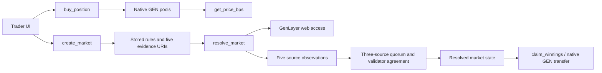

# Architecture

## Boundaries

The frontend is responsible for visualization, market browsing, wallet signing, and preparing calls. It does not invent markets, prices, chart points, or settlement results.

The Intelligent Contract is responsible for market state, native GEN value checks, positions, market discovery, pricing, contract-written observations, evidence-bound resolution, and payout accounting.

GenLayer validators are responsible for agreeing that the resolver output follows the fetched evidence and stored rules.
