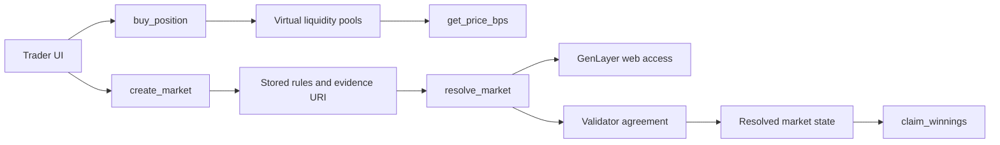

# Architecture

## Boundaries

The frontend is responsible for visualization, market browsing, and preparing calls.

The Intelligent Contract is responsible for market state, positions, pricing, evidence-bound resolution, and payout accounting.

GenLayer validators are responsible for agreeing that the resolver output follows the fetched evidence and stored rules.

